# Fundamental for future makers

The Fabrication Fundamentals course focused on developing practical skills across a wide range of manufacturing processes. For this project, I collaborated with Ishan and Erandi. While I already had previous experience with both 3D printing and CNC machining, the course proved especially valuable in expanding my knowledge of mold-making and biomaterial casting, allowing me to explore new experimental approaches to fabrication.

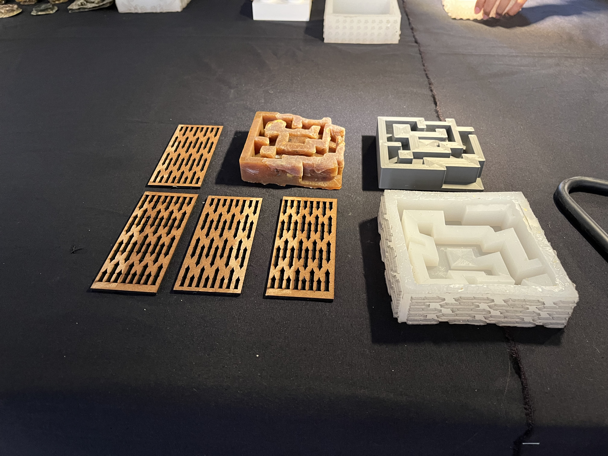
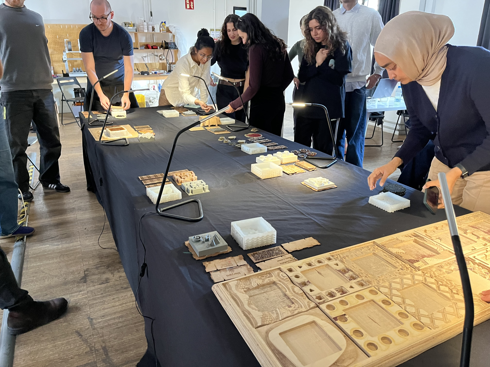

# Laser cutting

Drawing from references such as tattoo art, graffiti, and vinyl sticker aesthetics, we developed a strong visual language for the project. These influences shaped the graphic treatment of the box’s exterior, while the interior was conceived as a textured surface to introduce relief into the silicone mold. Using Rhinoceros 7, we designed the full pattern and construction layout digitally before fabrication, ensuring precision and consistency. The base includes a simple square indicator that defines the exact position for placing the 3D-printed object during the mold-making process.

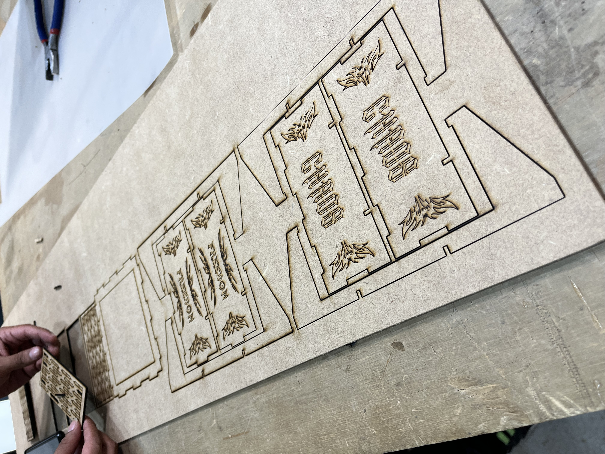
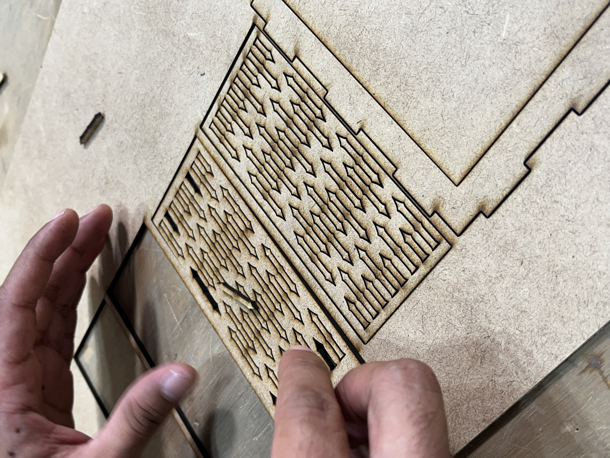
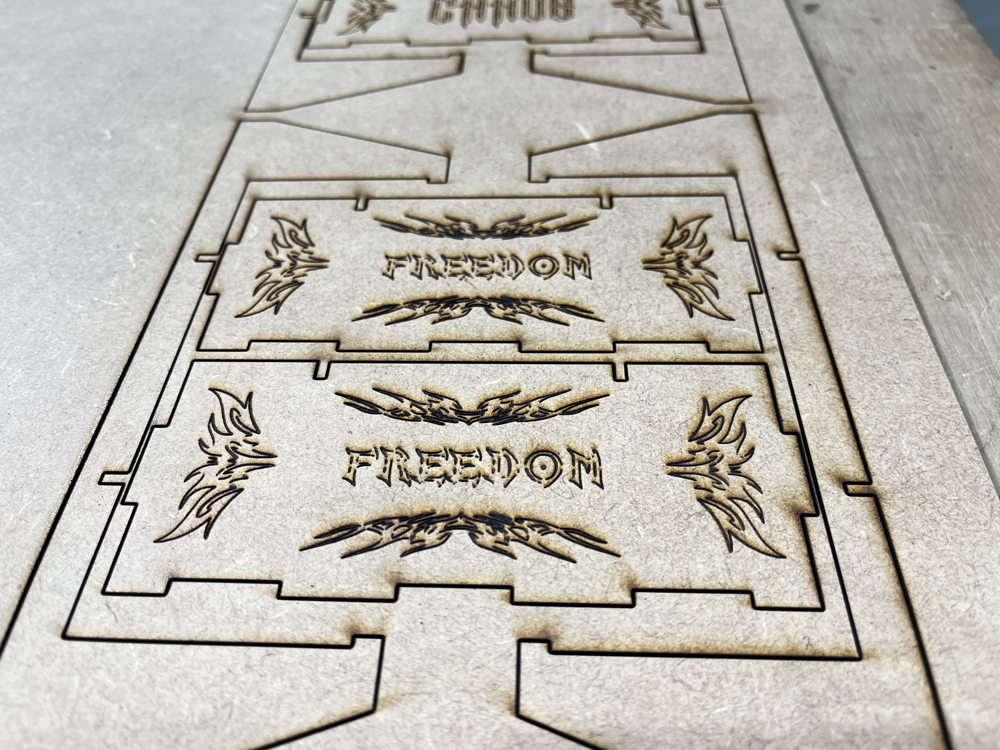
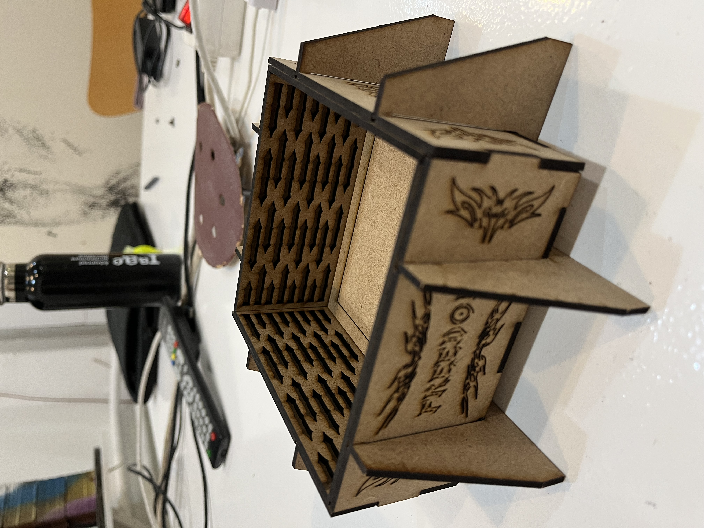

# 3D printing

For the 3D printing module, we designed a maze as an interactive object, conceived as a piece that could later be used with a marble to create a playful, hands-on experience. The first prototype was intentionally simple, but when we instructed the 3D printer to generate a concentric pattern, the resulting wall surfaces became irregular and inconsistent. After identifying these issues, we refined the geometry and improved the overall design. However, the mold prepared for the following class had already been produced using the initial version of the maze. The printing process was programmed and managed using Bambu Lab, allowing us to control parameters and iterate on the design efficiently.

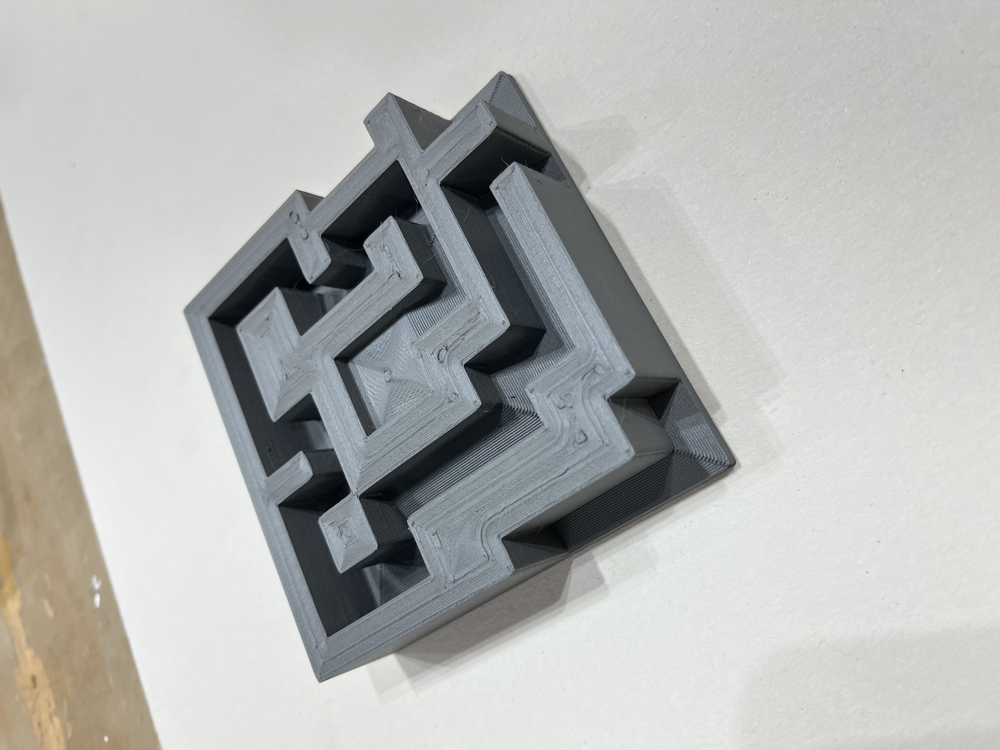
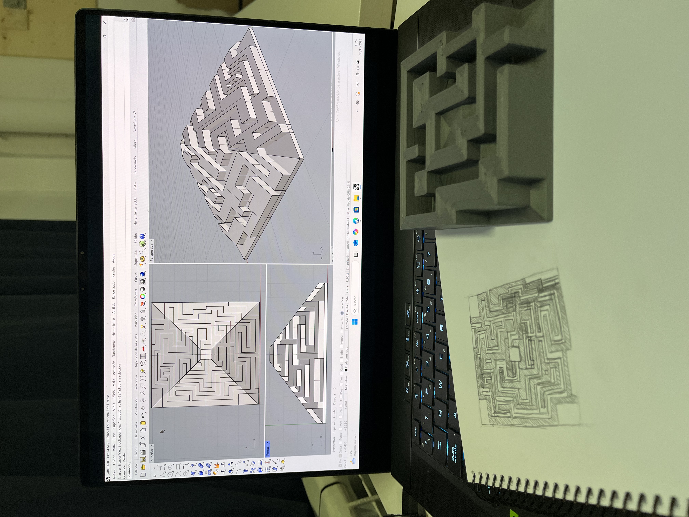
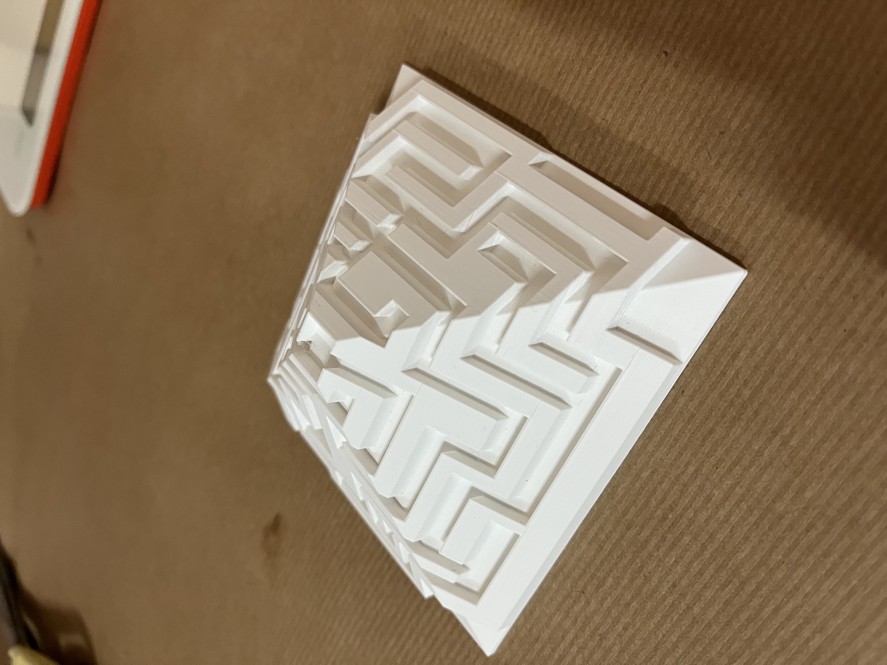

# CNC fabrication

For the CNC session, we decided to continue developing the maze concept introduced in the 3D printing exercise. We fabricated a base intended to support and present our final casting tiles, incorporating a simple maze-inspired pattern to enhance its visual quality while maintaining a functional structure for displaying the completed piece.

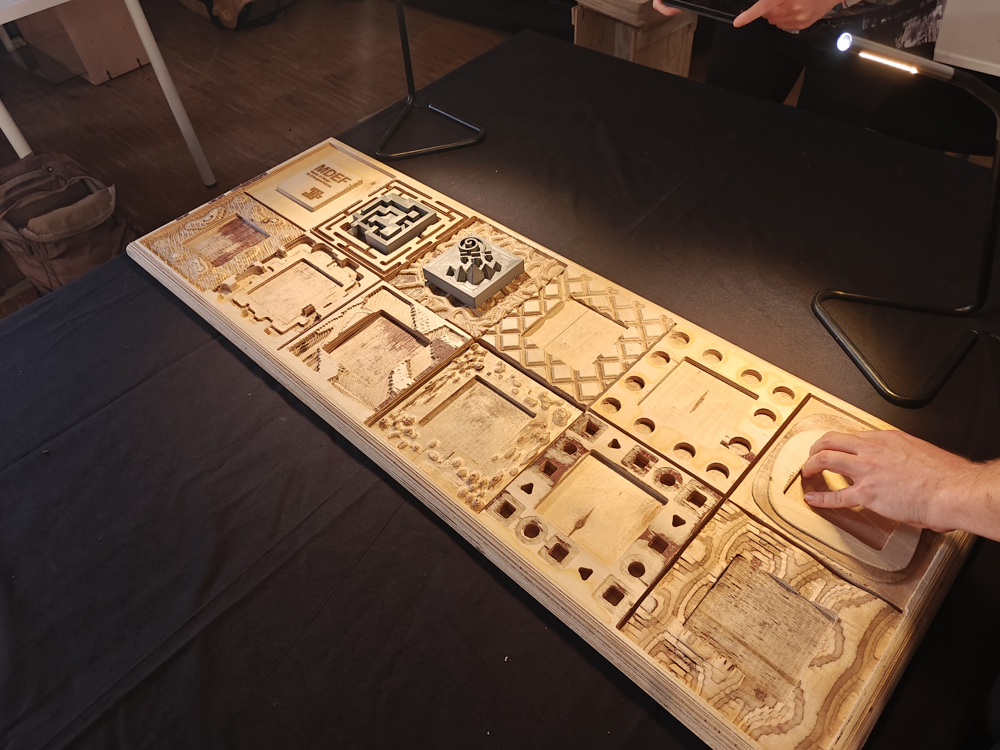
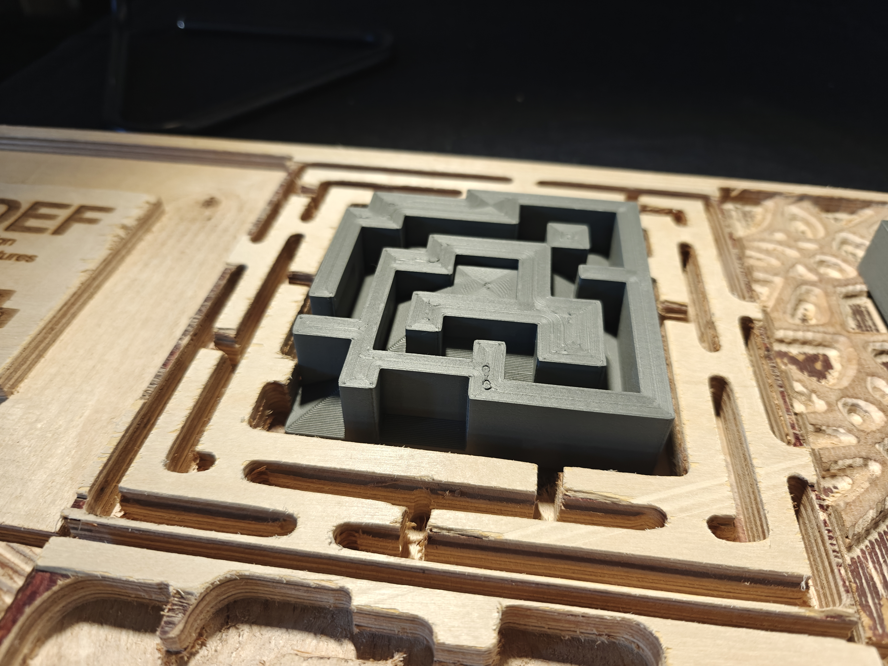
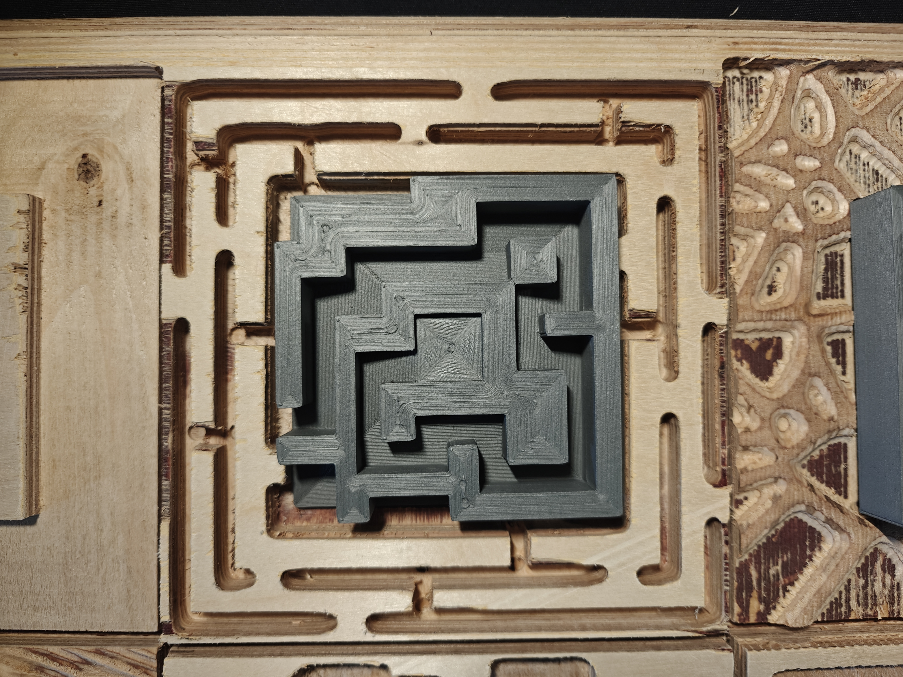

# Mold making

The mold was produced by combining the laser-cut box with the 3D-printed maze, filling the cavity between them with silicone. This stage required careful preparation, as the silicone demanded extensive mixing and precise handling, making the process both time-consuming and delicate. An additional difficulty emerged from minor gaps between the assembled box components, which caused small leaks during the pour and required constant attention throughout the curing process.

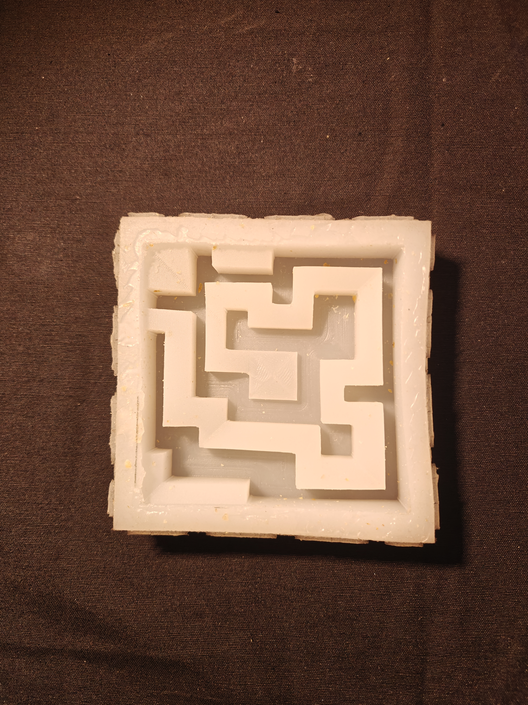
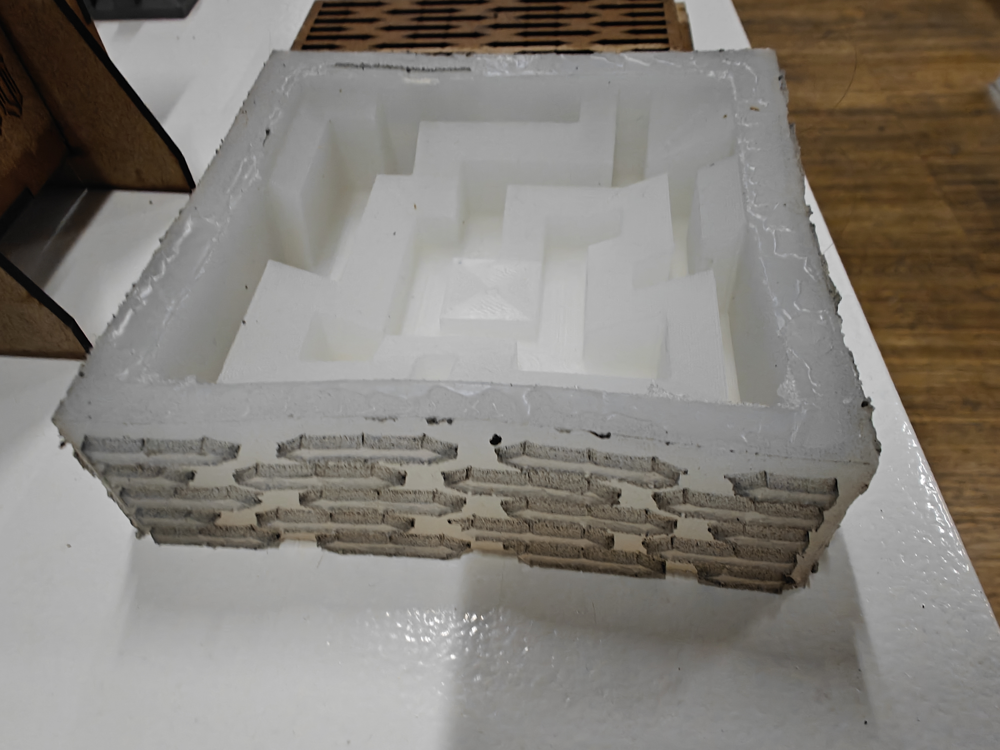

# Casting

We chose a pine resin–based formula for casting in our silicone mold. The mixture combined pine resin with natural fillers, casting wax, and alcohol, following a multi-step heating and pouring process to achieve the final material. This stage was especially challenging for me, as it was completely new, yet also one of the most engaging parts of the project. Although the final result did not fully match our expectations, the process itself became a valuable learning experience.