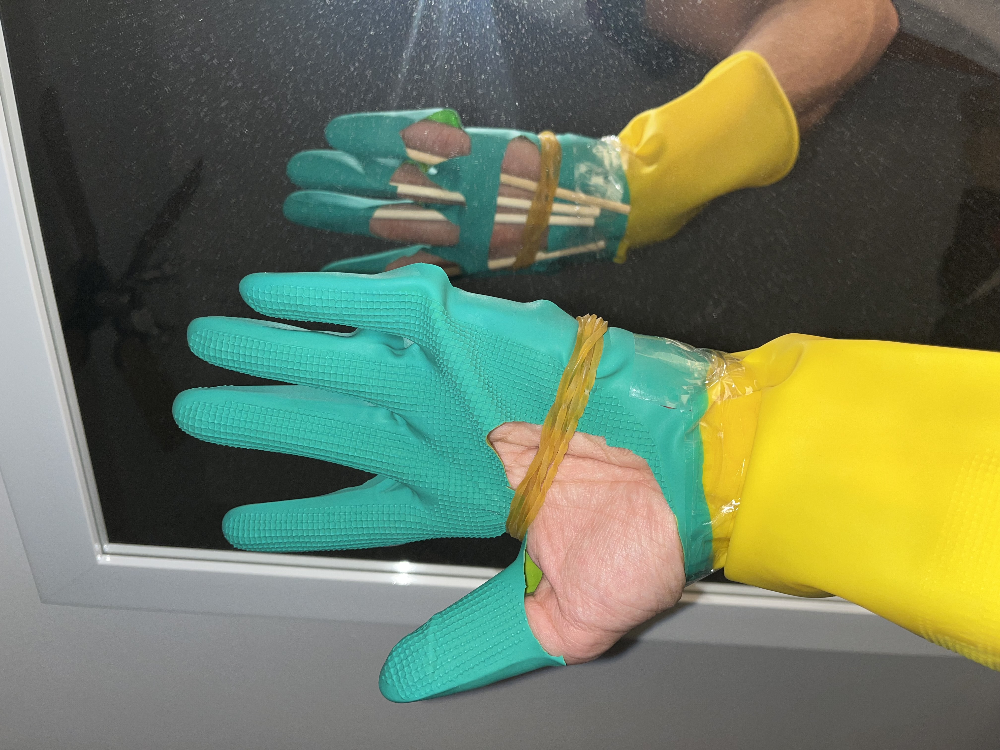
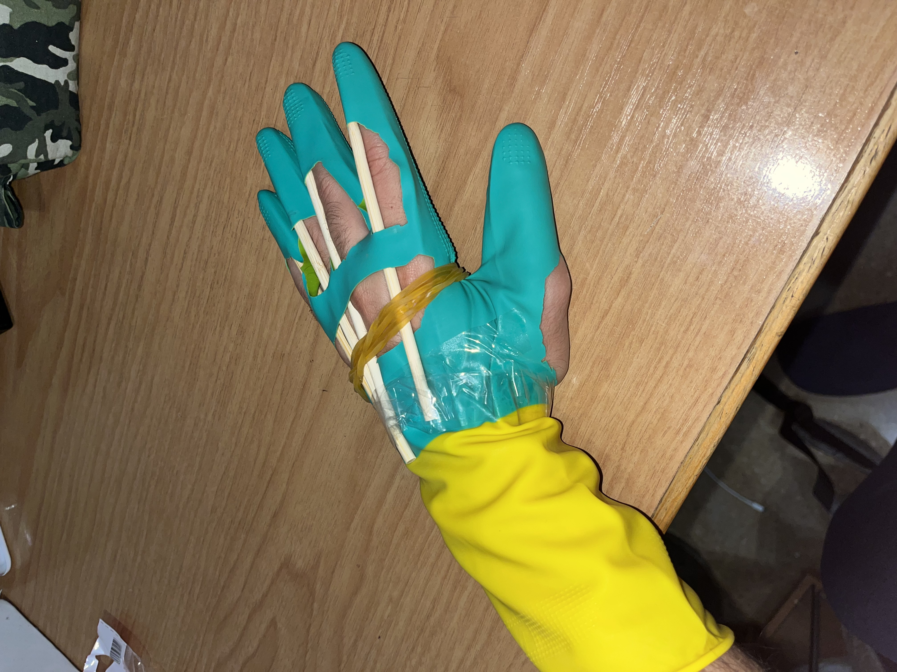

---
hide:
    - toc
---

# Living with your own ideas

# Prothesis to “become the best version of yourself”

Day 1: Reading Glove

On the first day, I developed a prosthesis that I called the “Reading Glove.”
It is constructed from a kitchen latex glove, elastic bands, and long wooden sticks. Its main function is to restrict the natural movement of the fingers, preventing me from closing my hand, forming a fist, or manipulating small objects—especially my phone.

When I put on the glove, my hand stops behaving like a conventional hand and becomes a kind of bodily book stand. The design physically forces me to hold the book while simultaneously preventing automatic behaviors such as unlocking my phone, sending messages, or engaging in impulsive movements. In this way, the prosthesis modifies not only my posture and physical actions, but also my behavior and level of attention.

Beyond its mechanical function, the act of putting on the glove becomes a conscious ritual. It is a declaration of intent: by wearing it, I communicate to my body and mind that it is time to read. This symbolic action creates a clear boundary between a state of distraction and a state of concentration, helping me enter a more disciplined mental mode.

In this sense, the glove functions not only as a functional prosthesis, but also as a psychological prosthesis. It does not enhance my physical abilities, but rather my capacity for self-control. My “better version” does not emerge from amplifying my instincts, but from strategically suppressing them, designing an object that deceives my mind and forces me to behave in the way I desire. The prosthesis therefore does not replace a physical deficiency, but intervenes directly in my will.

# Prothesis to “become something else”

