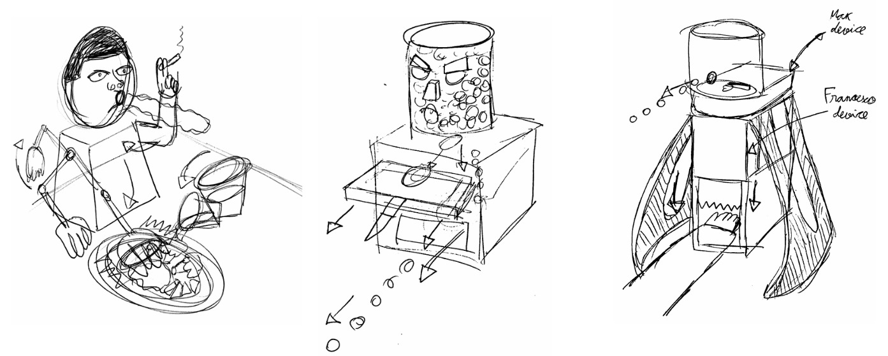
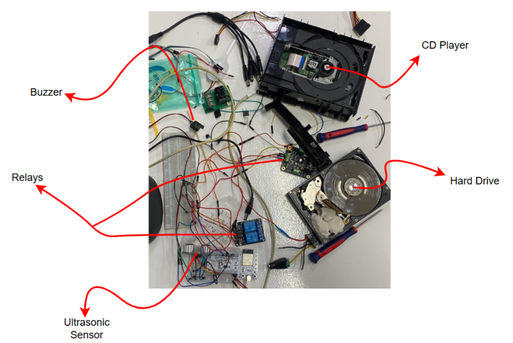
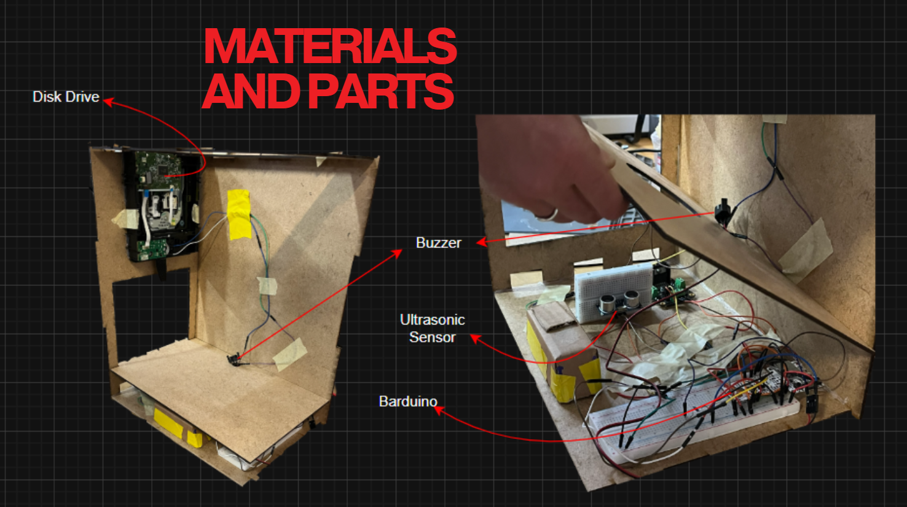
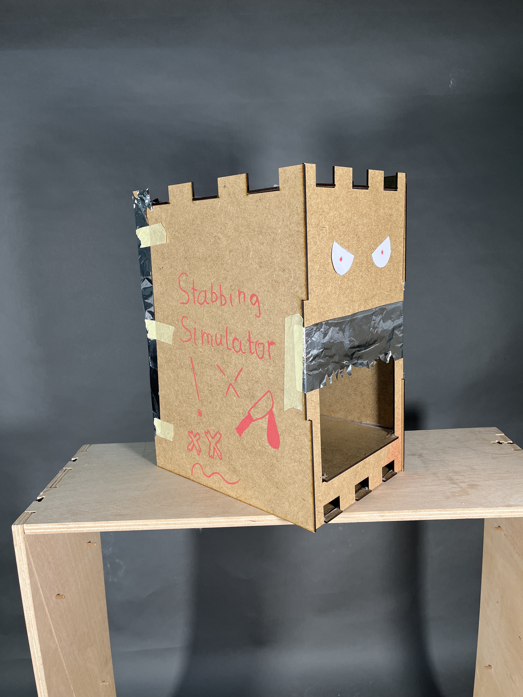
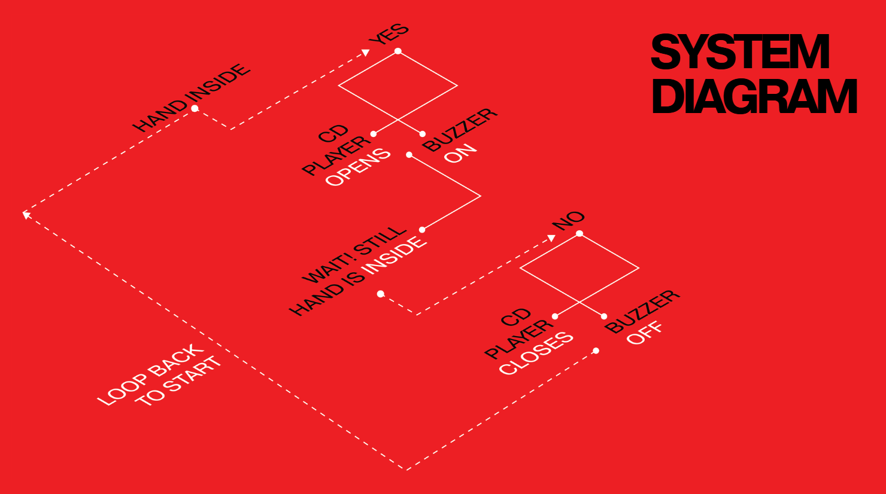
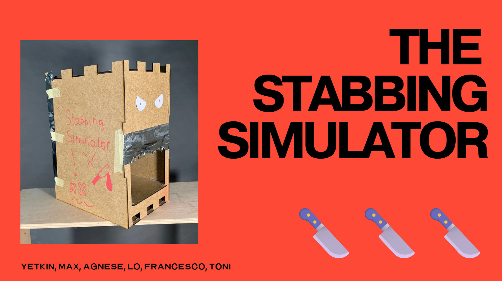

---
hide:
    - toc
---

# Machine Paradox Part 1: Unpackaging Tech Systems

In this hands-on two-week seminar, we dive into understanding how machines work and how to give them new life. We start by gathering discarded machines and everyday devices, exploring ones that catch our interest. From there, we disassemble them piece by piece, studying each component. Through this, we realize that we often toss devices out of convenience or because we don't fully understand their electronics, when, with a little know-how, they could actually be fixed.

Forensic Report: ...
===============

| Identity of the reporting agency       | MDEF                           |
|----------------------------------------|--------------------------------|
| Case identifier                        | Forensics of the Obsolescence  |
| Identity of the submitter              |           Agnes, Max, Toni, Yetkin, Francesco, Lo                   |
| Date of receipt                        |      19/11/2025                          |
| Date of report                         |        22/11/2015                        |

## Examination 

###  PC Desktop
**Serial number:** SF382
**Brand:** Intel
**Colour:** Black

:::
| Picture | Component | Serial Number | Brand | Specifications | Made in| 
| -------- | -------- | -------- | ------- | ------- | -- |
|| PC Shell | SF382 | Antec| ATX Mid-Tower | China
|| Fan | -| Antec | Power and speed cables |China
| | Speaker | -| Antec | (two cables) |China
|| Power Suply | DT090BCRX0022430| Antec | 380W 100V-240V 8A-4A 47 Hz-63Hz |China
| | Mother Board | 6627GE12B4F0| Intel | nylon PA66, ABS |China
| | CD Player | 909LAYA324090| LC | Laser class1, SATA, 5V 20.A/ 12V 2.5A |Korea
|| Hard Disc | CFFD9UKA| Hitachi Global | Model: HDT722525VLSA80 |Thailand

## Forensic Questions

**What does it do?** 
This PC desktop is performed as a personal computer for home or office use. 

*Key Components*
-Run Windows XP or early Windows Vista efficiently
-Handle multitasking better than single-core PCs (thanks to quad-core CPU)
-Store large amounts of data on 250GB HDD
-Play DVDs and early-to-mid 2000s PC games
-Connect via USB, Ethernet, and audio ports
-Quad-core capability means it could run multiple programs simultaneously with less slowdown.

*Simplified Operational Flow*
1. Power on → BIOS checks hardware
2. CPU starts → quad-core processor runs multiple tasks at once
3. Operating system loads from the hard drive.
4. Desktop ready → user can run programs, browse the web, or access files.

**How does it work?** 
CPU (Computation Processing Unit): Quad-core processor
RAM: 1–4GB DDR2
Storage: 250GB SATA HDD
OS: Windows XP
Power supply: 380W

**How is it built?** 
Case prepared → frame and panels ready.

Motherboard installed → CPU, RAM, and chipsets attached.

Power supply added → connected to motherboard.

Drives installed → 250GB HDD and DVD/CD drive placed.

Cables and fans connected → power, data, and airflow set up.

Side panels on & tested → BIOS checked and OS installed.

**Why it failed, or it wasn't used anymore?**
Outdated Technology: The system can’t keep up with modern software, web standards, or operating systems, even though the CPU, RAM, and drives still function.

Limited Compatibility: Ports, memory capacity, and hard drive speed make it impractical for today’s tasks, so users abandoned it in favor of newer machines.

## Steps taken
1. Open the case – Unscrew and slide out the side panels.
2. Remove the fan – Take out the CPU or case fan for inspection.
3. Remove the power supply – Unscrew and disconnect it from the case and motherboard.
4. Remove front panel components – Detach the power/reset buttons, USB ports, and front audio connections.
5. Remove the optical drive – Unscrew and slide out the CD/DVD reader.
6. Remove the motherboard – Unscrew it from the case and carefully lift it out.
7. Start testing individual components – Power supply, drives, RAM, CPU, etc., to ensure they work.

    <iframe 
        src="https://player.vimeo.com/video/1139856524" 
        width="800" 
        height="450" 
        frameborder="0" 
        allow="autoplay; fullscreen; picture-in-picture" 
        allowfullscreen
        title="Unpacking tech system">
    </iframe>

## Testing

After the disassembly process, we meticulously examined each individual component. Utilizing a precision lab power supply and a high-resolution multimeter, we conducted comprehensive tests to determine the optimal voltage required for each component's functionality.

## Examination 

### HP SERIES5 527SF
**Serial number:** 
**Brand:** HP
**Model:** SERIES5 527SF
**Colour:** Black

:::
| Picture | Component | Serial number | Quantity | Specifications | Made in | 
| -------- | -------- | -------- | ------- | ------- | -- |
| | Display | 3CM3510JRC | 1| Backlight, Polarized filter, TFT, Liquid Crystal, Color Filter, Polarized filter, cover glass | China
| | Buttons | R017117810263| 1 | 134x9mm, 3.3V, PBC |China
| Mother Board| R017122811011| 1 |MediaTek Micro controller, pcv |Korea
|| LCD control board |EALLBY4010A2| 1 | 1920x1080 pixel |China
## Forensic Questions

**What does it do?** 
Display (LCD Panel):
The display is the part that shows the final image. It receives the video signals and transforms them into visible light using liquid crystals and color filters.

Buttons / Control Panel:
The buttons allow the user to interact with the monitor: turning it on and off, navigating menus, changing brightness, etc. They serve as the interface between the user and the electronics.

Motherboard (Main Logic Board):
This board is the “brain” of the monitor. It processes the incoming video signal (HDMI/VGA), manages power distribution, stores firmware, and controls all the internal communication between components.

LCD Control Board (T-CON):
The T-CON board converts the processed video data from the motherboard into high-speed timing and voltage signals that drive the pixels of the LCD.

**How does it work?** 
Display (LCD Panel):
The LCD works by using a backlight that produces white light, which passes through layers of liquid crystals. When voltage is applied to specific areas, the crystals twist to let more or less light through. Combined with RGB filters, this creates colored pixels that form the image.

Buttons / Control Panel:
The buttons are simple tactile switches. When they are pressed, they complete a small electrical circuit on a secondary PCB. This sends a low-voltage signal to the motherboard, which interprets the action (power on, menu, etc.).

Motherboard:
It receives the video input, decodes it, and converts it into a digital format suitable for the LCD. It regulates voltages, controls the backlight, and sends structured video data to the T-CON board. It does this using integrated circuits, memory, and power regulators.

LCD Control Board (T-CON):
The T-CON organizes the timing of the image by sending high-speed pulses to row and column drivers. These signals determine when each pixel should activate and how much voltage it should receive to twist the liquid crystals.

**How is it built?** 
The monitor is built as a compact layered system. At the front, the LCD panel is made of thin glass layers with liquid crystals inside, supported by a plastic and metal frame. Behind it, there is a backlight that provides the illumination needed for the image.

All the electronics are mounted behind the screen. The main board processes the video signal, and a smaller control board sends the timing signals to the pixels. These boards are connected with ribbon cables and fixed to the back housing. The buttons are placed on a small board along the edge of the frame and simply send signals when pressed.

Overall, the monitor is assembled by stacking the screen, the light system, and the electronic boards together in a compact, enclosed structure.

**Why it failed, or it wasn't used anymore?**
The monitor had been physically damaged — the LCD panel was completely broken, likely from a fall or a strong impact. Because the glass was shattered, it could no longer display an image. However, all the internal components such as the buttons, motherboard, and control board were still functional. The monitor was discarded only because the screen itself was destroyed.

## Steps taken
1. Cleaned the dust off the printer and brought it to the MDEF room
2. Disassembled using our toolbox
3. Laid out all parts individually and documented.

## Testing

After the disassembly process, we meticulously examined each individual component. Utilizing a precision lab power supply and a high-resolution multimeter, we conducted comprehensive tests to determine the optimal voltage required for each component's functionality.

# Machine Paradox Part 2

# REFLECTIONS

Before this project, I had never opened or disassembled an electronic device, which made the whole experience both unexpected and exciting. Exploring the inside of an old computer gave me a completely new perspective on technology. I was surprised by the number of components hidden inside, from the CD reader and cooling fan to the motherboard and many smaller elements that usually go unnoticed. Examining and testing each part to determine whether it was still functional felt like solving a puzzle, and I was always eager to see if the components we planned to reuse would actually work.

Designing a “useless machine” was also a unique challenge because it required a different mindset than most design projects. Instead of focusing on functionality and efficiency, we had to intentionally create something without practical value while still making it engaging and meaningful. Reaching a shared vision within the group took time, as everyone had different ideas and preferences. Through discussion and collaboration, however, we eventually arrived at a concept that reflected contributions from all team members.

After establishing the main idea, organizing and distributing responsibilities became crucial to keep the project moving forward efficiently. Throughout this process, I gained valuable experience with Arduino programming and laser-cutting techniques. At first, both tools seemed intimidating, but as I worked with them, I became much more confident in using them.

Producing the final video was one of the most enjoyable stages of the project. It provided an opportunity to communicate our concept clearly and transform our ideas into a visual narrative that others could easily understand.

Overall, this project encouraged me to step outside my comfort zone and engage with technology in a more hands-on and creative way. It not only introduced me to new tools and processes but also helped me develop practical skills and collaborative experience that I believe will be valuable in future projects.
