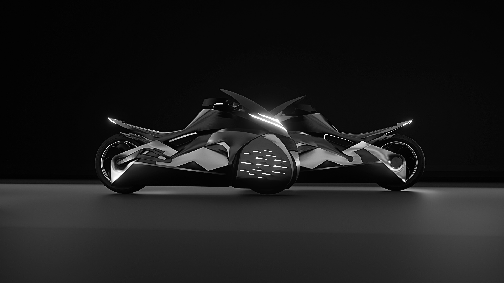
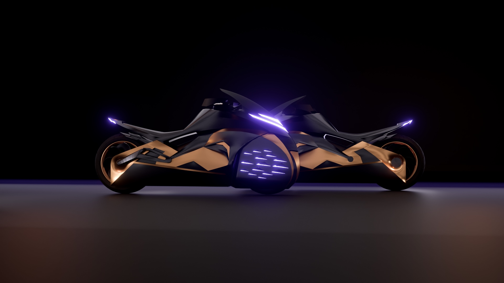

# About

<section class="education-experience">

  <h2>Education</h2>
  <ul>
    <li><strong>Bachelor’s in Industrial Design Engineering and Product Development</strong>, Escuela Universitaria de Diseño Industrial, Universidade da Coruña (2021–2025)</li>
    <li><strong>Technological High School Diploma</strong>, Instituto de Educación Secundaria Breamo (2018–2021)</li>
    <li><strong>Compulsory Secondary Education</strong>, Instituto de Educación Secundaria Breamo</li>
    <li><strong>Primary and Early Education</strong>, Grande Obra de Atocha</li>
    <li><strong>Lifeguard Training</strong>, Summer Season</li>
  </ul>

  <h2>Work Experience</h2>
  <ul>
    <li><strong>Summer Lifeguard</strong>, Miño Beaches, June–September 2024</li>
    <li><strong>Product Designer</strong>, Navantia – Next Pioneers Hackathon, Ferrol, Spain / March 2025</li>
    <li><strong>Staff Member</strong>, Biocultura Fair (Asociación Vida Sana), A Coruña, Spain / March 2025</li>
  </ul>

  <h2>Volunteering</h2>
  <ul>
    <li><strong>Learning and Service Project</strong>, Physics I, EUDI – Teima Down, 2021</li>
    <li><strong>Learning and Service Project</strong>, Design and Polymer Processing, EUDI – AFAL Ferrolterra, 2024</li>
  </ul>

</section>
<section class="profile">

 <h2>About Me</h2>
  

    I am an industrial design and product development engineer, trained at the Escuela Universitaria de Diseño Industrial, Universidade da Coruña. I am passionate about innovation and solving real-world problems, creating functional products with impactful aesthetics.
  

  

    I am creative, dedicated, and collaborative. I enjoy exploring innovative solutions but also value teamwork and the exchange of ideas and knowledge. I am a visionary, able to recognize potential in people and my team. I enjoy entrepreneurship and independently carry out projects to strengthen my personal brand and gain hands-on experience.
  

  <h2>Knowledge & Skills</h2>
  <ul>
    <li>Advanced computing and integration of design in manufacturing</li>
    <li>Materials engineering</li>
    <li>Artistic expression</li>
    <li>Graphic expression</li>
    <li>Marketing</li>
    <li>Fundamentals of physics</li>
    <li>Mechanical systems</li>
    <li>Computer-aided analysis</li>
    <li>Machine theory</li>
    <li>Economic and business aspects of design</li>
    <li>Information and communication technologies</li>
    <li>Industrial processes</li>
    <li>Industrial administration and organization</li>
    <li>Design and processing with polymers</li>
    <li>Industrial logistics</li>
    <li>Semiotics and psychology of perception</li>
    <li>Design regulations and legislation</li>
  </ul>

  <h2>Software Skills</h2>
  <ul>
    <li>Adobe Illustrator</li>
    <li>Adobe InDesign</li>
    <li>Adobe Photoshop</li>
    <li>SolidWorks</li>
    <li>Rhinoceros</li>
    <li>Autodesk Fusion</li>
    <li>Autodesk Meshmixer</li>
    <li>Slicer software</li>
    <li>Repetier</li>
    <li>SketchUp</li>
    <li>Blender</li>
    <li>Microsoft Word, Excel, PowerPoint, Outlook</li>
    <li>Vizcom</li>
    <li>OpenAI</li>
    <li>Deepseek</li>
  </ul>

  <h2>Personal Information</h2>
  <ul>
    <li><strong>Name:</strong> Antonio García Fernández</li>
    <li><strong>DNI:</strong> 32725893K</li>
    <li><strong>Date of Birth:</strong> 29/03/2003</li>
    <li><strong>Address:</strong> c/Monfero P2 4ºB, C.P. 15600</li>
    <li><strong>Phone:</strong> 604003381</li>
    <li><strong>Email:</strong> tonideume@gmail.com</li>
    <li><strong>Degree:</strong> Bachelor’s in Industrial Design Engineering and Product Development</li>
    <li><strong>University:</strong> Escuela Universitaria de Diseño Industrial, Universidade da Coruña</li>
    <li><strong>Years:</strong> 2021–2025</li>
  </ul>

  <h2>Languages</h2>
  <ul>
    <li>Spanish – Native</li>
    <li>Galician – Native</li>
    <li>English – B2</li>
    <li>Italian – A2</li>
  </ul>

 

</section>
  <h1>
    NEW AMPHIBIOUS MOTORCYCLE CONCEPTS FOR CUPRA 
    2024 / 2025
  </h1>
  

    <strong>Partner Company:</strong> 
    SEAT / CUPRA
  

  

    <strong>Project Director:</strong> 
    Prof. Dr. José R. Méndez Salgueiro 
    Rodrigo Martínez Rodríguez
  

  

    <strong>Professors:</strong> 
    José R. Méndez Salgueiro 
    Jon Solozabal Basañez 
    Álvaro Deibe Díaz 
    Ahitor Regueiro Fernández 
    José Ramón Souto López 
    Cristina Prado Acebo 
    Rodrigo Martínez Rodríguez
  

</head>
  

    The rapid pace of technological innovation has reshaped how people seek experiences, entertainment, and excitement, driving demand for increasingly innovative and emotionally engaging products. This project focuses on designing a vehicle capable of navigating multiple terrains and environments, offering users unprecedented freedom while providing society with a practical and valuable solution. Traditional personal watercraft are fun but rarely integrated into daily life and seldom create a strong emotional connection with the user. Our amphibious motorcycle aims to bridge that gap, combining revolutionary driving experiences with a deep personal bond.
  

  

    The target user is a young, highly educated, and independent member of Generation Z, influenced by contemporary social norms, peer groups, and personal preferences. They are tech-savvy, interested in AI, IoT, and emerging technologies, enjoy adrenaline and sports, value freedom, and seek meaningful travel experiences. Motorcycling is a key passion, creating a social and emotional connection that this vehicle reinforces.
  

  

    In use, the motorcycle transitions seamlessly from land to water. On the road, it behaves like a standard motorcycle. Upon entering water, lateral pneumatic stabilizers deploy, followed by retractable foils using hydraulic or pneumatic mechanisms. A rear foil-integrated propeller then engages, enabling hydroflight—lifting the vehicle above the water for a smooth, agile, low-friction, and immersive aquatic experience.
  

</section>

