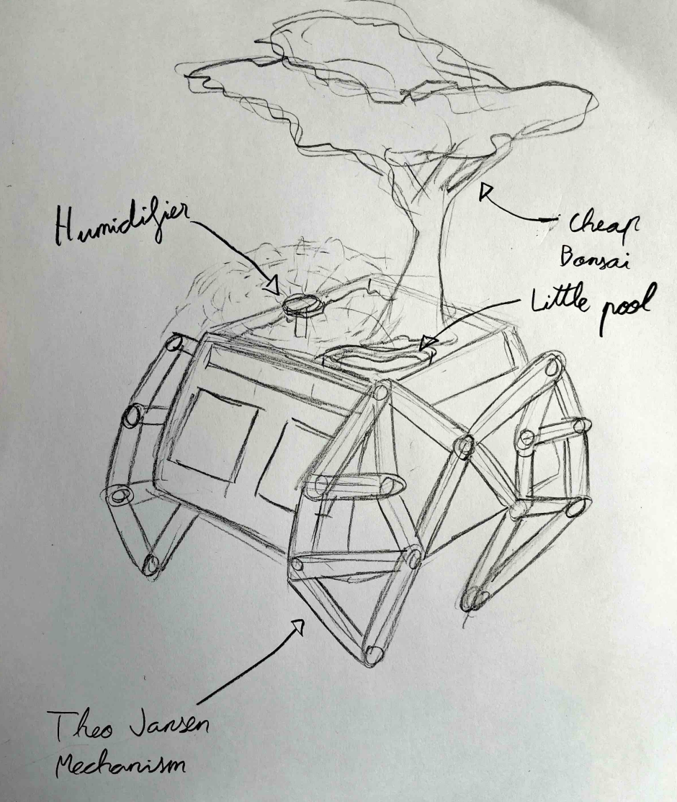
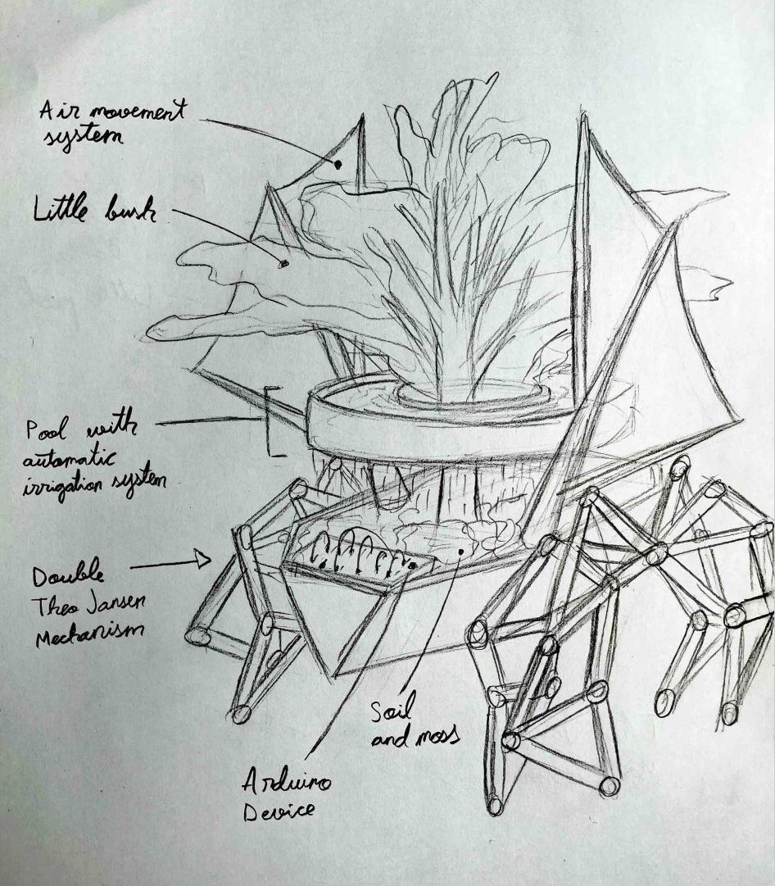

---
hide:
    - toc
---
# Cognitive orgies
<!DOCTYPE html>
<html>
<head>

</head>

<body>

    

        

        In this one-week workshop, we worked as a team to create a prototype that would help us continue researching our field of interest and support the development of our main project for the Design Studio course. I carried out this activity with Erandi, whose research field focuses on studying alternative perspectives within the context of the city, moving away from the anthropocentric view. My field of study is urban mobility, so to create a prototype that would fit both fields, we looked for common points that would help us develop an idea.
        

    

 

        
    

</body>
</html>
<!DOCTYPE html>
<html>
<head>

</head>

<body>

    

       We ended up finding points of connection in our interests and in relation to our fields of study, specifically in low-tech approaches, decentralization, and urban space. We linked these points to our respective research areas: mobility (mine) and multispecies and
    

  

 non-human perspectives (hers). Based on these connections, we proposed our prototype called ‘Nomadic Infrastructure for Urban Microecosystems'.
    

</body>
</html>

   

   Research Question. 
    

   

    How can we create an autonomous mechanical organism, inspired by walking structures, that transports environmental conditions (shade, humidity, and shelter) to enable the survival of insects and other organisms in hostile urban environments?. 
    

<!DOCTYPE html>
<html>
<head>
<meta charset="UTF-8">
<title>Bloque Tres Columnas</title>

</head>

<body>

<!-- Columna de texto -->
   

        
   1-Sketching the initial idea. 

 Using this question as our guide, we began sketching and shaping the prototype, drawing inspiration from the fascinating mechanisms of Theo Jansen and his kinetic sculptures. 
 The concept consist on create an machine that searches the perfect conditions for a microecosistem of his own. It moves because urban hostility is not static. Heat, shade, dryness, and exposure shift constantly in the city and most non-human species lack the ability to escape them. Mobility becomes a survival strategy.      

    

<!-- Primera columna de imagen -->

        
    

<!-- Segunda columna de imagen -->
 

        
    

</body>
</html>

<!-- Columna de texto -->
   

        
 2-Laser cutting the pieces. 

To achieve our goal, we needed: a mobile, mechanical, functional, and autonomous structure; a terrarium to hold soil, moss, and other elements to create suitable conditions for microorganisms; and the appropriate electronic components to measure the conditions of that micro-ecosystem. 
We downloaded the files for the Theo Jansen mechanism for the moving structure and cut them using the laser cutter.
        

    

<!-- Primera columna de imagen -->

        
    

<!-- Segunda columna de imagen -->
 

        
    

<!-- Columna de texto -->
   

        
 3-Assembling
         the structure. 

We assembled the mechanism — 12 legs in total. We had to buy a lot of screws from the hardware store, and it was tricky to tighten the nuts just enough to allow movement without making the structure unstable.
We mounted the two servomotors with the legs through a shaft, which would rotate gears when the motors were activated, causing the mechanism to move and the structure to start walking.
        

    

<!-- Primera columna de imagen -->

        
    

<!-- Segunda columna de imagen -->
 

        
    

<!-- Columna de texto -->
   

        
 4-The terrarium. 

With the Arduino, we prepared the most important part of the prototype: 3 sensors in total — one humidity sensor, one photosensitive sensor, and one temperature sensor. This way, we tell the two servo motors when they need to move to search for a more suitable habitat for the organisms in the micro-ecosystem.
We designed a terrarium to hold the soil, moss, and worms. We laser-cut it entirely in MDF, and then assembled it together with the structure, Arduino, and batteries.
        

    

<!-- Primera columna de imagen -->

        
    

<!-- Segunda columna de imagen -->
 

        
    

<!-- Columna de texto -->
   

        
 5-Final. 

The final step was to assemble the mobile structure with the terrarium, which would interact through the sensors, and the Arduino would activate the servomotors when there was a lack or excess of light, humidity, or temperature.
        

    

<!-- Primera columna de imagen -->

        
    

<!-- Segunda columna de imagen -->
 

        
    

</body>
</html>

   

   Result and reflections. 
    

    

        
Final prototype

 In this one-week workshop, we worked as a team to create a prototype that would help us continue researching our field of interest and support the development of our main project for the Design Studio course. I carried out this activity with Erandi, whose research field focuses on studying alternative perspectives within the context of the city, moving away from the anthropocentric view. My field of study is urban mobility, so to create a prototype that would fit both fields, we looked for common points that would help us develop an idea.
        

    

 

        
    

    

        
Circuit diagram

 Looking at the final Arduino circuit diagram, we can see how the sensors, actuators, and microcontroller work together to make the prototype respond to environmental conditions. Ideally, we would have liked to include ultrasonic or proximity sensors so that the prototype could avoid obstacles and be more aware of its surroundings, but we didn’t have enough time to implement them. 
        

    

 

        
    

    

        
The main issue

The main problem we encountered with the project was the servomotors, which have a 180-degree range, preventing the mechanism from moving in a specific direction and only allowing it to sway slightly back and forth. If it weren’t for this issue and a few adjustments needed on the leg shafts, the prototype would have achieved its goal, but we will continue working to make it fully functional.
        

    

 

        <video src="../images/WhatsApp Video 2026-02-06 at 15.18.11.mp4" autoplay loop muted playsinline></video>
    

